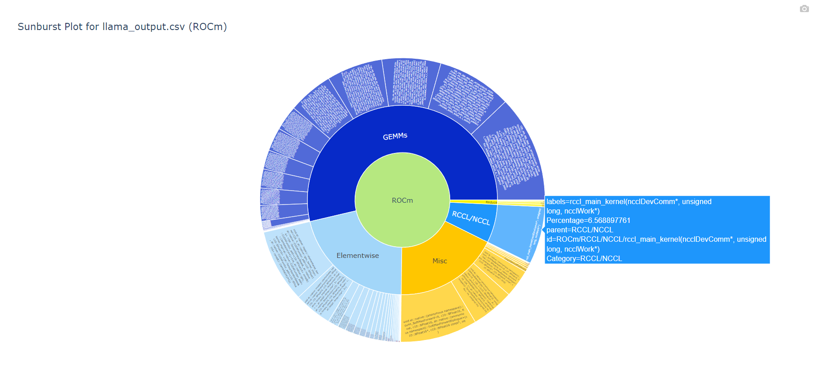
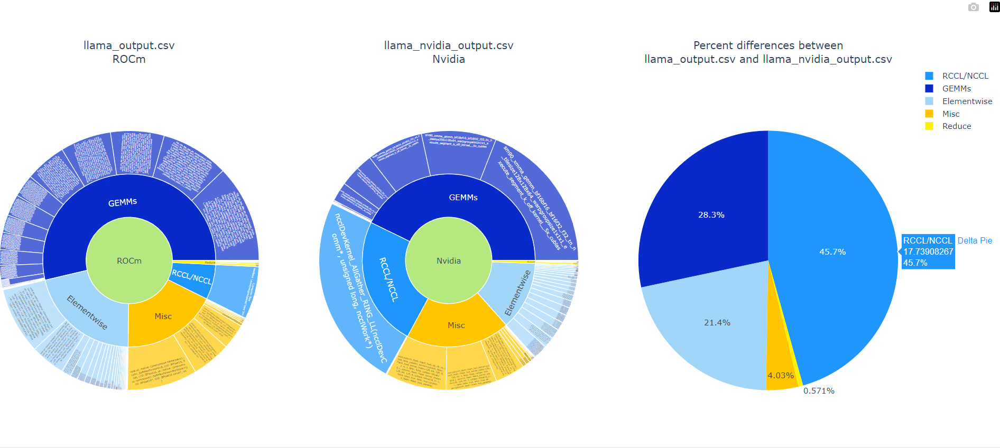

# autocoplite
AutocopLite: RPD trace visualization toolkit

## Installation Instructions

### Prerequisites

Make sure you have Python 3 installed on your system. You can download Python from the official [Python website](https://www.python.org/downloads/).

### Setting Up the Project

Within the main rocmProfileData repository, cd into the autcoplite submodule directory and initialize the submodule:

  ```sh
  git submodule update --init --recursive
  ```

This command will initialize, fetch and checkout the submodule to the commit specified in the main repository.

To update the submodule at any time and pull the latest changes, run:

  ```sh
  git submodule update --remote
  ```
You can use the provided Makefile to install the dependencies into a python virtual environment named ```aclite```. Simply run:

```make install```

Alternatively, you can manually install the packages using **pip**:

```pip install -r requirements.txt```

To uninstall the packages and remove the virtual environment, you can use the Makefile:

```make clean```

 or manually remove the virtual env:

 ```rm -rf aclite```

## Standalone plot example

```python autocop_cli.py single_plot <csv_file> <architecture> <output_html>```

```python autocop_cli.py single_plot llama_output.csv ROCm output_plot_rocm_standalone.html```



## Comparison plot example

```python autocop_cli.py compare_plot <csv_file1> <arch1> <csv_file2> <arch2> <output_html>```

```python autocop_cli.py compare_plot llama_output.csv ROCm llama_nvidia_output.csv Nvidia comparison_output.html```



## HTML 
**Download the html files in HTML for interactive view in Chrome or other browser**

